Установка:
npm install

Запуск:
npm run dev

# Frontend сайта
Используется:

- tailwind css
- NextJS
- React loading indicators
- React paginate
- React icons
- Swiper
- scss

P.s.
Отсутствует полная адаптивность:
Исопльзуются исключительно "px" по макету (для пк-версии)

Скриншоты сайта (не макет):

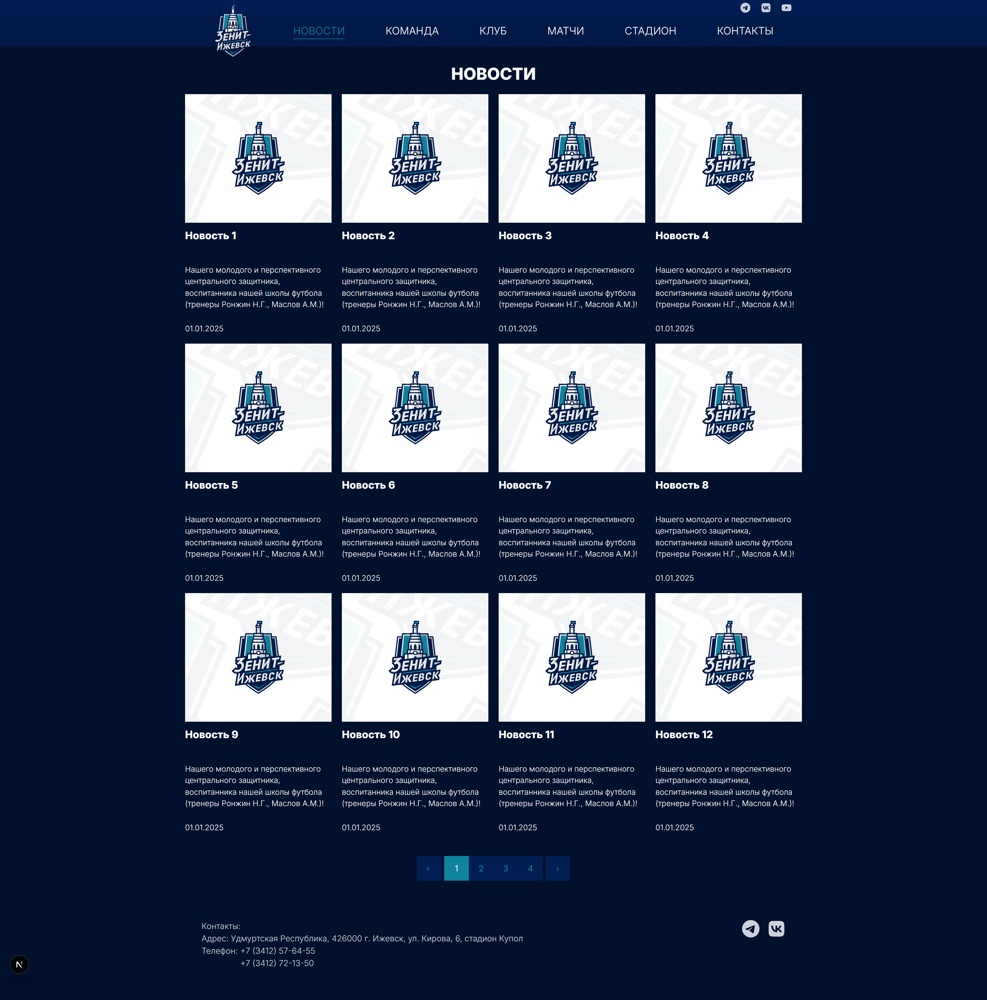

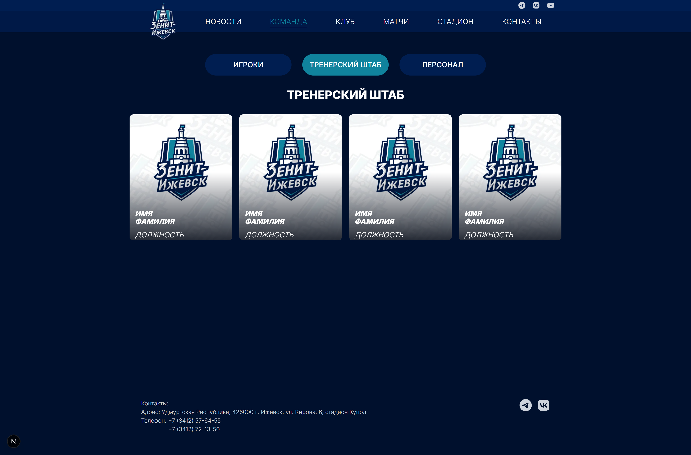

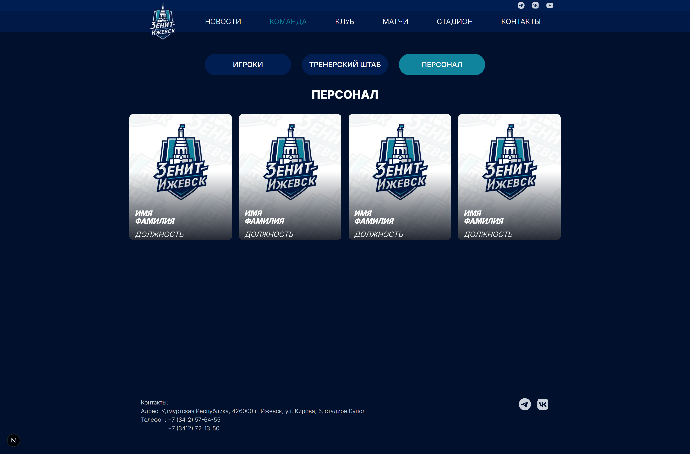

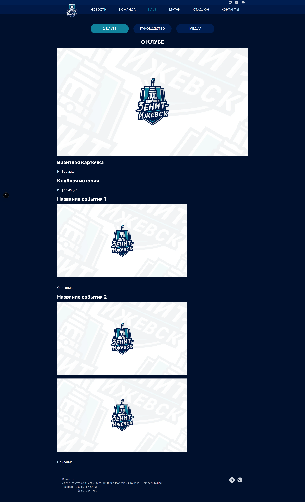

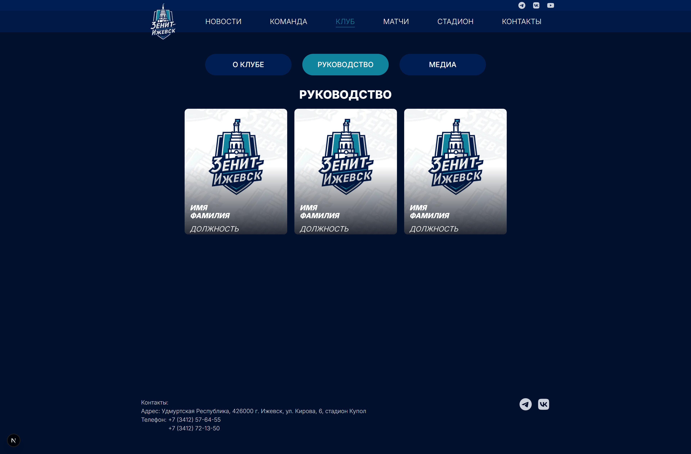

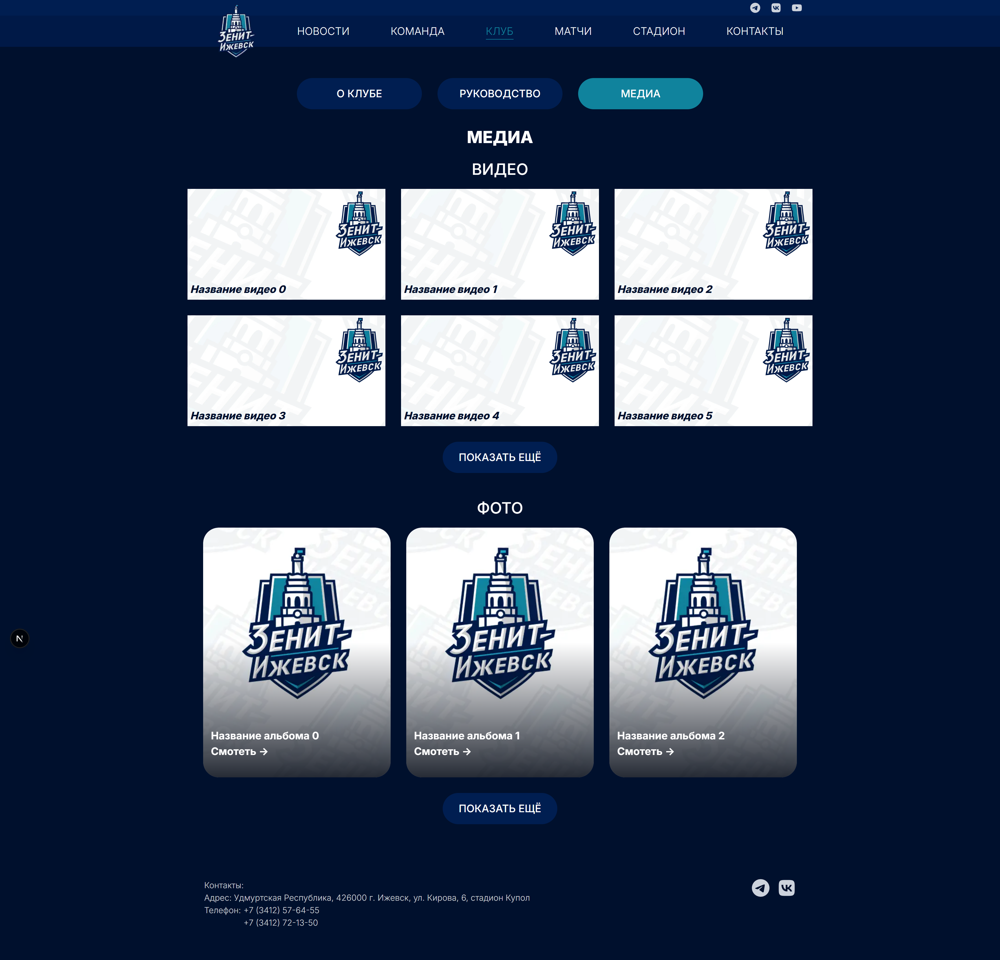

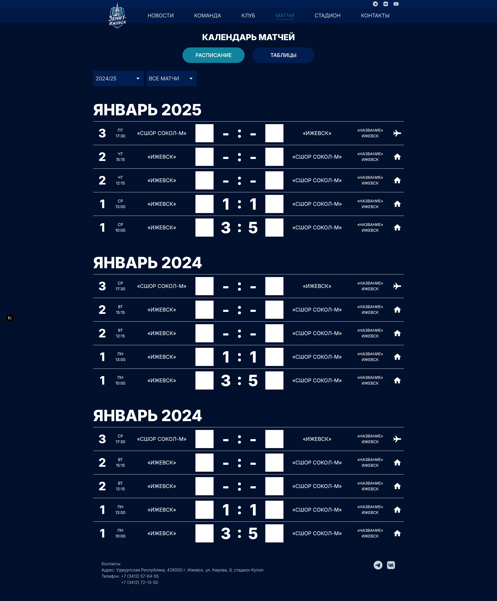

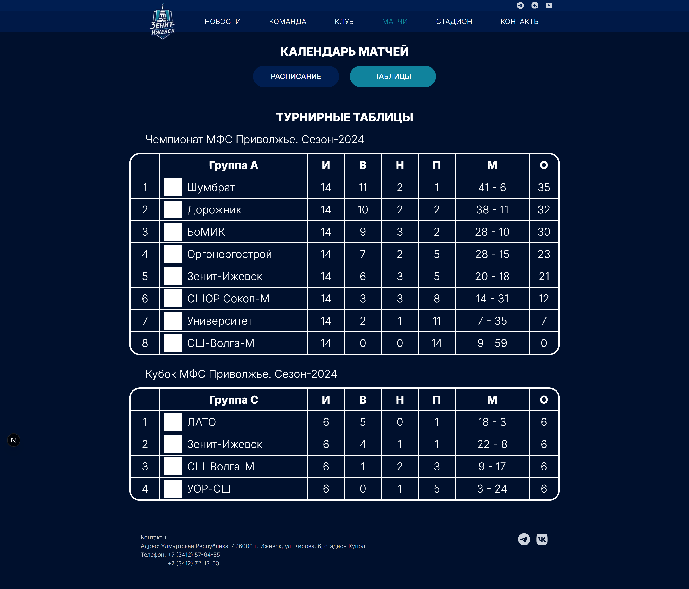

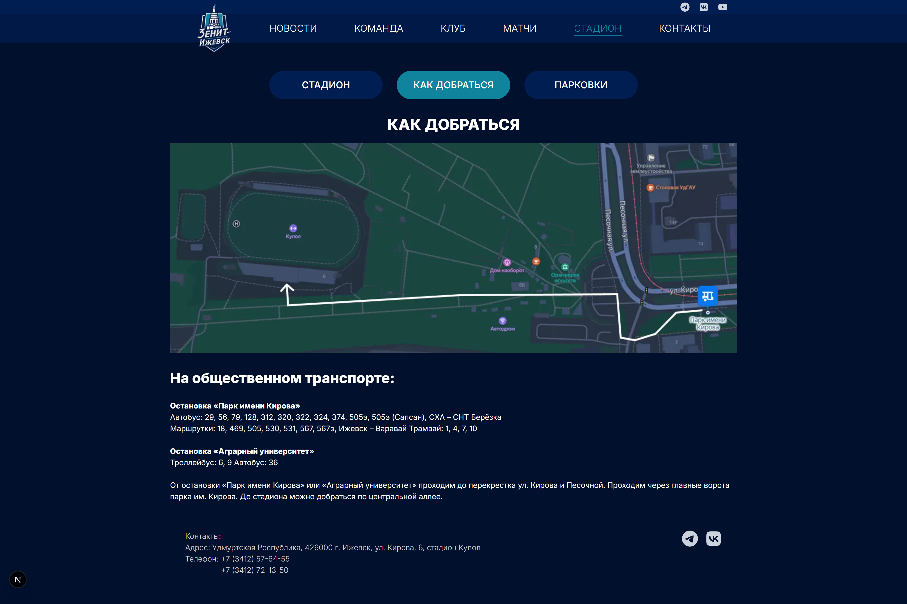

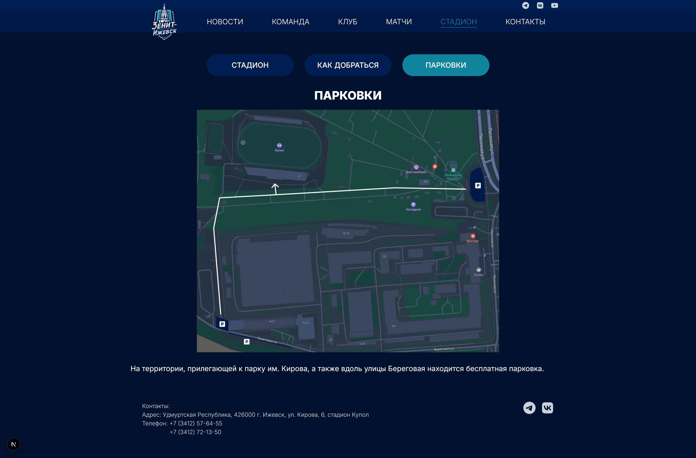

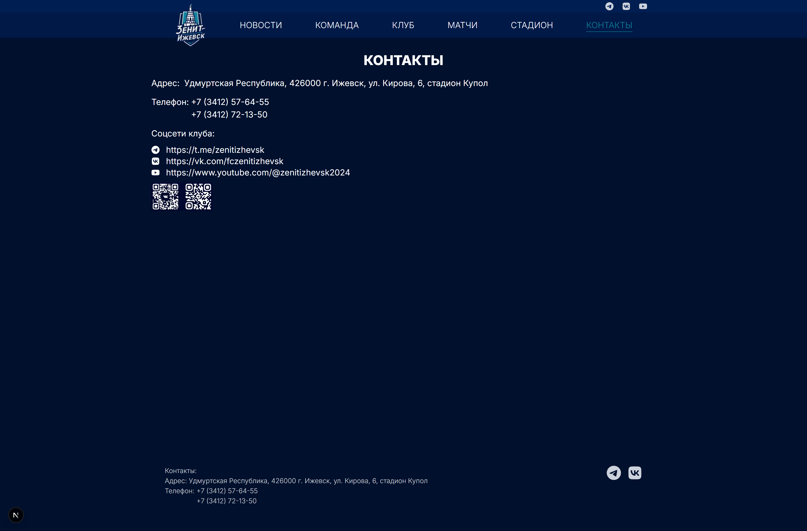